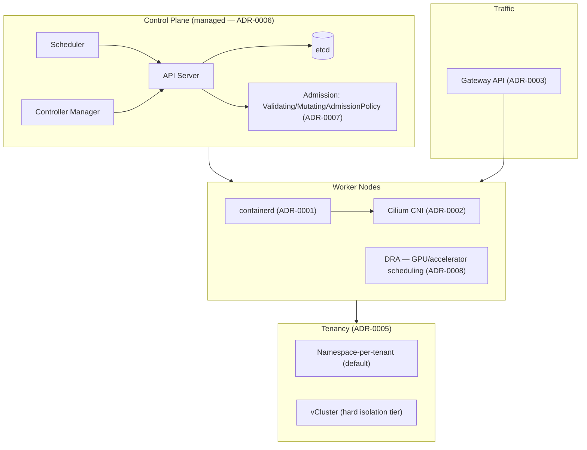

# Architecture Overview

## Component diagram

## Reading the diagram

- **Control plane**: managed by the cloud provider by default (ADR-0006). Admission control runs
  in-process via CEL-based policies rather than external webhooks (ADR-0007).
- **Worker nodes**: containerd as the runtime (ADR-0001), Cilium for networking (ADR-0002), DRA for
  any node exposing GPUs/accelerators (ADR-0008).
- **Traffic**: enters through Gateway API resources, not legacy Ingress, for anything new (ADR-0003).
- **Tenancy**: most workloads land in a namespace-scoped tenant; workloads needing hard isolation
  (external customers, regulated data) get a vCluster instead (ADR-0005).

## What this repo does *not* cover

This is a platform-layer reference, not an application architecture. It doesn't prescribe how your
services talk to each other, your CI/CD pipeline design, or how you build observability dashboards
end-to-end — those are real decisions but out of scope here. Cost discipline (ADR-0009), stateful
workload handling (ADR-0004), and the observability pipeline are the places this repo reaches
slightly above the platform layer, because they're easy to get wrong at the platform level and
expensive to fix later. See each top-level platform concern folder's own README for exactly what is and isn't included —
`observability-telemetry/README.md` in particular is explicit about where the pipeline reference
ends and a full observability platform would begin.
